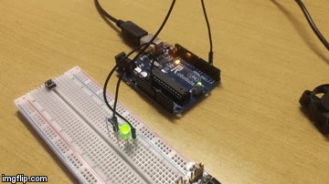
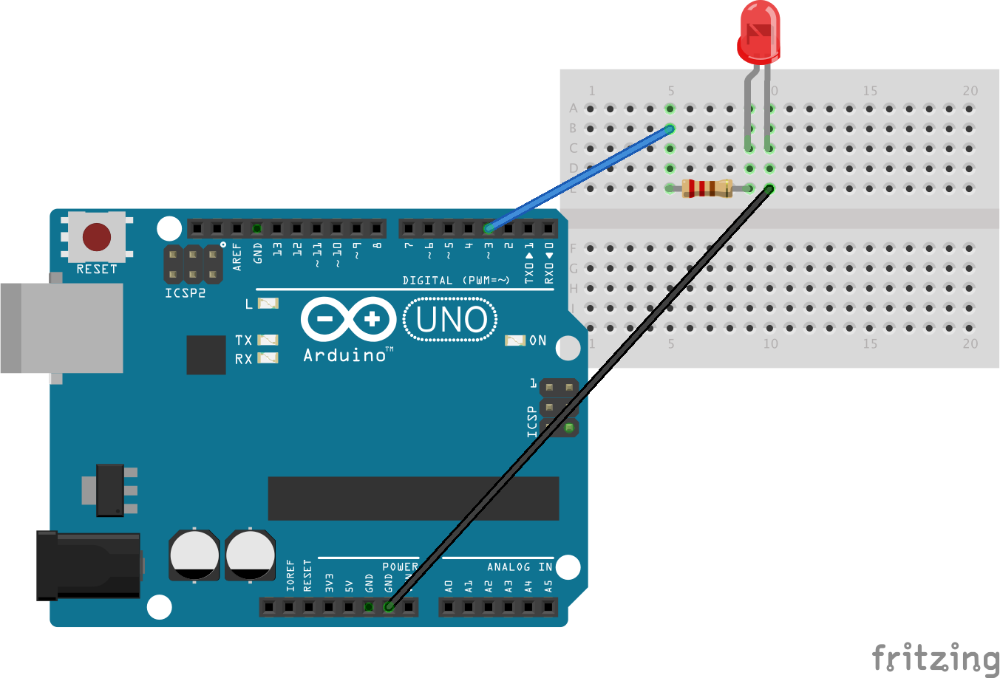

# PWM_light_DEMO2

PWM using a LED brightness to demonstrate that as average voltage changes the brightness varies.

## Components
- Arduino Uno
- Breadboard
- Jump Wires
- 220 Ohm Resistor

## Circuit Schematic

